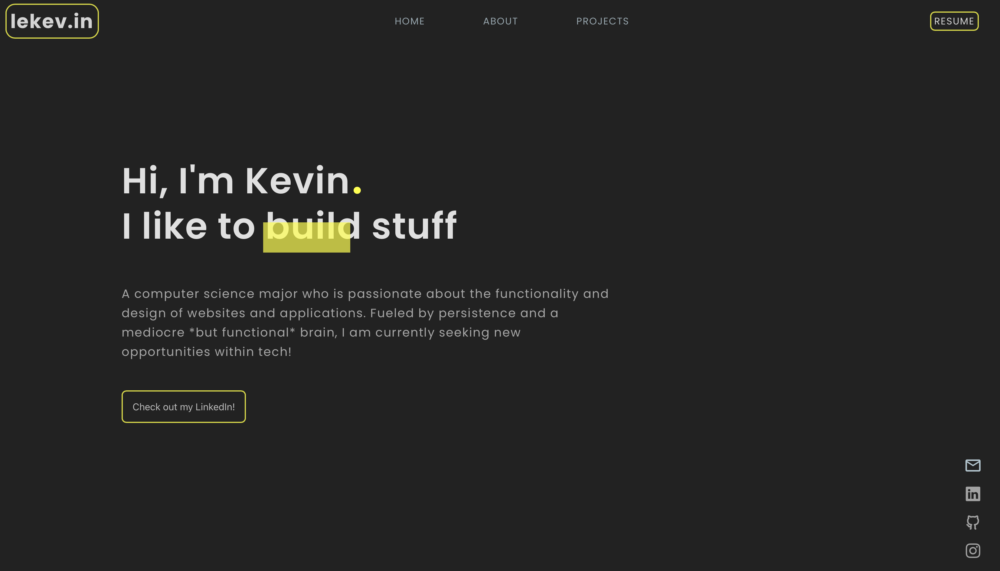

<h1 align="center">
   
  
   
  lekev.in
   
</h1>

<h4 align="center">Click to view a website I built ⇨ <a href="http://lekev.in" target="_blank">lekev.in</a></h4>

  

  Worked with:  
                 
                
                
                
                
                
                
                
                
                
                
                

<h1 align="center">

</h1>

## I love coffee

## Bio

Welcome to my Github! I graduated Fall 2022 at Wichita State University with a degree in Computer Science and a minor in mathematics. Some of my hobbies
include games (Valorant mainly!!), traveling, tennis, fishing, golfing, and creating stuff! 

